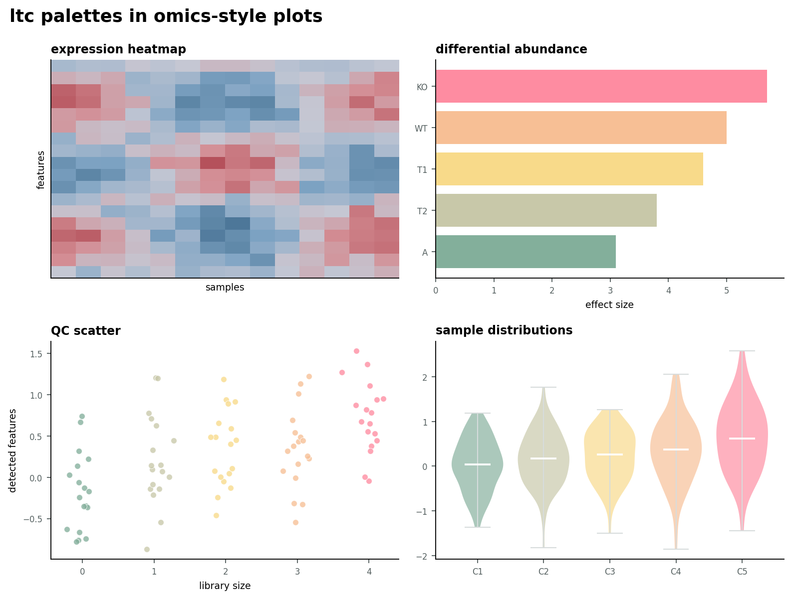

# py-ltc-color-palettes

[](https://github.com/marioernestovaldes/py-ltc-color-palettes/actions/workflows/docs.yml)
[](https://opensource.org/licenses/MIT)
[](https://www.python.org/downloads/)

Python replica of the R package [`loukesio/ltc-color-palettes`](https://github.com/loukesio/ltc-color-palettes).

This package ports the upstream palettes, palette metadata, color adjustments,
color-vision-deficiency preview, swatch plot, and bird plot to Python. The API is
Pythonic where R syntax does not translate directly: use quoted palette names and
0-based indexes for `which`.

## Links And Explorer

- Documentation: <https://marioernestovaldes.github.io/py-ltc-color-palettes/>
- Live palette explorer: <https://marioernestovaldes.github.io/py-ltc-color-palettes/palette-explorer.html>
- Source repository: <https://github.com/marioernestovaldes/py-ltc-color-palettes>
- Upstream R reference: <https://github.com/loukesio/ltc-color-palettes>



## Install

```bash
pip install py-ltc-color-palettes
```

For local development:

```bash
pip install -e ".[dev]"
```

## Usage

```python
from py_ltc_color_palettes import ltc, plot_palette

maya = ltc("maya")
fig, ax = plot_palette(maya)
```

## Documentation

The hosted MkDocs Material site is available at
<https://marioernestovaldes.github.io/py-ltc-color-palettes/>.

The live palette explorer is available directly at
<https://marioernestovaldes.github.io/py-ltc-color-palettes/palette-explorer.html>.
It includes live palette selection, brightness adjustment, color-vision
simulation, and omics-style chart previews.

The docs contain the fuller package tour: palette gallery, discrete and
continuous examples, palette adjustment, desaturation, color-vision-deficiency
preview, and plotting helpers.

Build the MkDocs Material site locally:

```bash
mkdocs serve
```

## Reference

The authoritative reference implementation is the R package at
`https://github.com/loukesio/ltc-color-palettes`, specifically the upstream
`main`/v0.4.0 behavior used when this Python port was created.

Palette data and license text are ported from the upstream MIT-licensed project.
