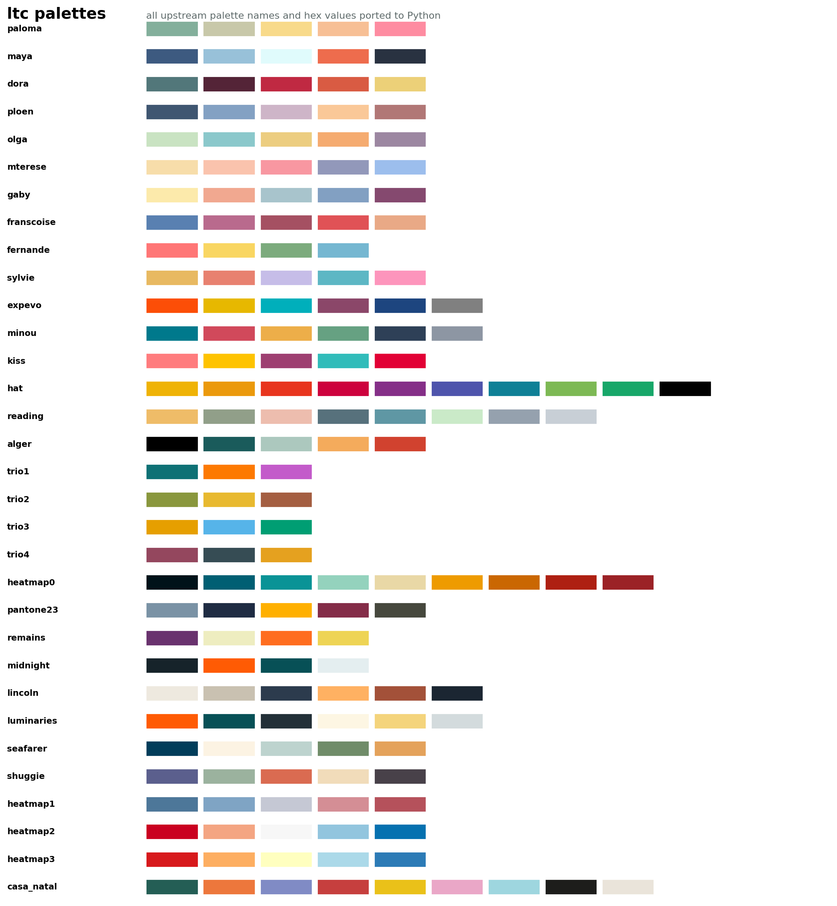

# Palette Gallery

The Python package ports the upstream R palette names, hex values, and bios.
Palette names are strings, and `palettes` is a read-only mapping.



```python
from py_ltc_color_palettes import palettes

print(list(palettes))
```

## Palettes

| Palette | Count | Hex colors | Bio |
| --- | ---: | --- | --- |
| `paloma` | 5 | `#83AF9B, #C8C8A9, #f8da8a, #f7bf95, #fe8ca1` | Daughter of Francoise Gilot and Pablo Picasso |
| `maya` | 5 | `#3d5a80, #98c1d9, #e0fbfc, #ee6c4d, #293241` | Daughter of Marie-Therese Walter and Pablo Ruiz Picasso |
| `dora` | 5 | `#52777A, #542437, #C02942, #D95B43, #ECD078` | French photographer, painter, and poet |
| `ploen` | 5 | `#3F5671, #83A1C3, #CEB5C8, #FAC898, #B17776` | A beautiful village in Northern Germany |
| `olga` | 5 | `#c9e3c2, #8bc8cb, #eccd80, #f5ab70, #9c87a1` | Olga Khokhlova was a Russian ballet dancer |
| `mterese` | 5 | `#f7ddaa, #fac3ad, #f897a1, #9298BA, #9cbeed` | Marie-Therese Walter was a French model and mother of Maya |
| `gaby` | 5 | `#fceaab, #f1a890, #a8c4cc, #82A0C2, #85496F` | Gabrielle Depeyre Lespinasse was a French dancer |
| `franscoise` | 5 | `#5980B1, #b96a8d, #A55062, #E05256, #E9A986` | Francoise Gilot was a significant French painter |
| `fernande` | 4 | `#ff7676, #F9D662, #7cab7d, #75B7D1` | Fernande was a French model and artist |
| `sylvie` | 5 | `#E8B961, #E88170, #C6BDE8, #5DB7C4, #FD95BC` | Sylvette David is a French artist and model |
| `expevo` | 6 | `#FC4E07, #E7B800, #00AFBB, #8B4769, #1d457f, #808080` | A palette that is often being used by biologists |
| `minou` | 6 | `#00798c, #d1495b, #edae49, #66a182, #2e4057, #8d96a3` | Minou was Picasso's favorite cat |
| `kiss` | 5 | `#FF7C7E, #FEC300, #9E3F71, #31BCBA, #E20035` | Inspired by The Kiss Picasso 1925 |
| `hat` | 10 | `#efb306, #eb990c, #e8351e, #cd023d, #852f88, #4e54ac, #0f8096, #7db954, #17a769, #000000` | Inspired by Woman in Hat Picasso 1937 |
| `reading` | 8 | `#EFBC68, #919F89, #EDBDAE, #57717C, #5F97A4, #CAEAC8, #95A1AE, #C8CFD6` | Inspired by Two Girls Reading Picasso 1934 |
| `alger` | 5 | `#000000, #1A5B5B, #ACC8BE, #F4AB5C, #D1422F` | Inspired by Les femmes d'Alger Picasso 1955 |
| `trio1` | 3 | `#0E7175, #FD7901, #C35BCA` | A discrete color palette to visualize 3 variables |
| `trio2` | 3 | `#89973D, #E8B92F, #A45E41` | A discrete color palette to visualize 3 variables |
| `trio3` | 3 | `#E69F00, #56B4E9, #009E73` | A discrete color palette to visualize 3 variables |
| `trio4` | 3 | `#94475E, #364C54, #E5A11F` | A discrete color palette to visualize 3 variables |
| `heatmap0` | 9 | `#001219, #005F73, #0A9396, #94D2BD, #E9D8A6, #EE9B00, #CA6702, #AE2012, #9B2226` | A diverging color palette suitable for heatmaps |
| `pantone23` | 5 | `#7A92A5, #1F2C43, #FFB000, #842c48, #46483d` | Soft Chaos was released by Pantone in Summer 23 |
| `remains` | 4 | `#69326E, #EEEDC0, #FF6D1F, #EED455` | Inspired by The Remains of the Day by Kazuo Ishiguro (Booker Prize 1989) |
| `midnight` | 4 | `#16232A, #FF5B04, #075056, #E4EEF0` | Inspired by Midnight's Children by Salman Rushdie (Booker Prize 1981) |
| `lincoln` | 6 | `#EEE9DF, #C9C1B1, #2C3B4D, #FFB162, #A35139, #1B2632` | Inspired by Lincoln in the Bardo by George Saunders (Booker Prize 2017) |
| `luminaries` | 6 | `#FF5B04, #075056, #233038, #FDF6E3, #F4D47C, #D3DBDD` | Inspired by The Luminaries by Eleanor Catton (Booker Prize 2013) |
| `seafarer` | 5 | `#013D5A, #FCF3E3, #BDD3CE, #708C69, #E4A25B` | Inspired by The Old Man and the Sea theme - maritime literary palette |
| `shuggie` | 5 | `#5B5F8D, #9BB29E, #DA6B51, #F1DCBA, #484149` | Inspired by Shuggie Bain by Douglas Stuart (Booker Prize 2020) |
| `heatmap1` | 5 | `#4d7799, #7fa4c4, #c5c8d4, #d48e95, #b5515b` | Blue and Red diverging palette 7 - ideal for heatmaps and expression data |
| `heatmap2` | 5 | `#ca0020, #f4a582, #f7f7f7, #92c5de, #0571b0` | Blue and Red diverging palette 8 - classic diverging scheme |
| `heatmap3` | 5 | `#d7191c, #fdae61, #ffffbf, #abd9e9, #2c7bb6` | Blue and Red diverging palette 9 - warm-cool diverging palette |
| `casa_natal` | 9 | `#245E55, #ED773C, #808BC5, #C63F3E, #EAC119, #EAA7C7, #9ED6DF, #1D1D1B, #EAE4DA` | Casa Natal on the Plaza de la Merced, the birthplace of Picasso |

## Inspect Hex Values

```python
from py_ltc_color_palettes import palettes

for name, colors in palettes.items():
    print(name, colors)
```

For a live visual overview, use the
[Palette Explorer](palette-explorer.html).
